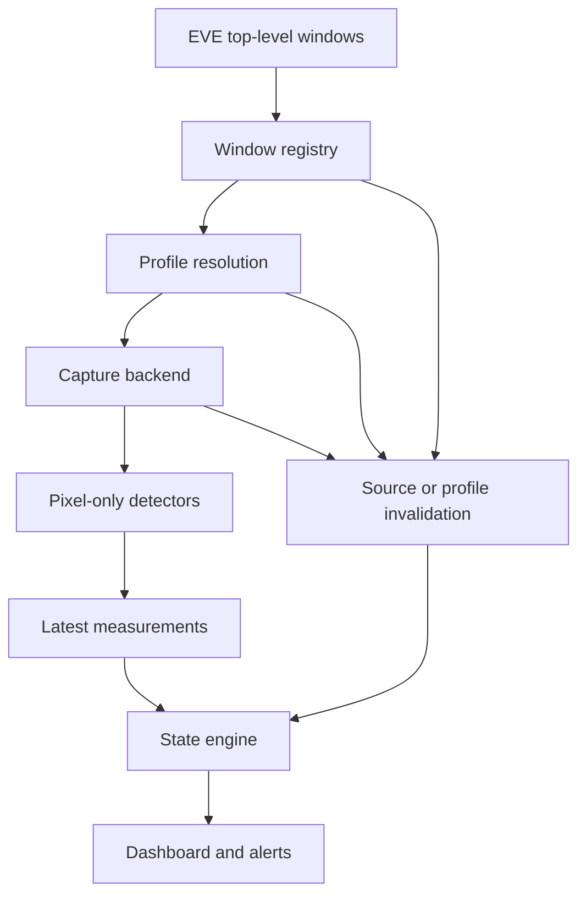

# MinerWatch Architecture

Status: First core implementation, 2026-09-28

Branch: `feature/minerwatch-foundation`

The normative boundary and acceptance criteria are in `MINERWATCH_CONTRACT.md`.
The rationale for changes from the original draft is in `adr/0001-observer-core.md`.
This document distinguishes existing code from proposed integration.

## 1. Current implementation

| Component | Location | Status |
|---|---|---|
| Logical client/window registry | `src/MinerWatch.Core/Windows` | Implemented, mock-tested |
| Windows discovery adapter | `src/MinerWatch.Tool/Win32WindowEnumerator.cs` | Compiled; live Windows/EVE check pending |
| Immutable profile/ROI models, resolver | `src/MinerWatch.Core/Profiles` | Implemented, tested |
| Strict JSON profile loader | `src/MinerWatch.Tool/ProfileFile.cs` | Implemented, tested |
| Owned BGRA ROI frames, capture/detector interfaces | `src/MinerWatch.Core/Capture` | Implemented contracts, no backend/detector implementation |
| Typed measurements, state policy, state engine | `src/MinerWatch.Core/State` | Implemented, tested |
| Measurement replay CLI | `src/MinerWatch.Tool/Replay.cs` | Implemented, tested |
| WGC / DWM Atlas / diagnostic capture adapters | Future Windows integration | Not implemented |
| Calibrated hold/harvester detectors | Future core detection layer | Awaiting real image fixtures |
| Scheduler and measurement coordinator | Future core/host services | Not implemented |
| Dashboard, attention queue, alerts | Future WPF presentation | Not implemented |

`MinerWatch.slnx` builds the new core, tool and executable test harness. The old
`EveProj.sln` remains independent; it is neither a runtime dependency nor proof of
production capture compatibility. New core targets .NET Standard 2.0. Development
tools/tests target .NET 10. The existing UI remains on .NET Framework 4.8.

## 2. Intended data path

The coordinator owns this path and source invalidation. There is no reverse game
command path. A detector receives only `RoiFrame` and numeric parameters; no HWND,
window enumerator, native texture or client-control service.

## 3. Registry and observation epochs

`EveWindowRegistry` accepts a roster of immutable `ClientRegistration` objects.
The host must persist these logical IDs. An enumerated `WindowObservation` contains
only handle/process/title/class/geometry/availability metadata. Exact process-name
and provisional title matching identify candidate windows. Duplicate matches are
Ambiguous. Missing clients remain visible as Missing rather than disappearing from
the operator's roster. Minimized, hidden, cloaked or incomplete sources are Unavailable.

`ClientBinding.Generation` advances when the selected source changes, including
geometry, DPI, process start time or availability. Consumers must invalidate before
accepting new samples and reject in-flight work from the old generation. This
generation is local to a registry lifetime; a restarted observer starts with no evidence.
For profile/detector/capture-session changes, the future coordinator must issue a new
observation epoch or reconstruct the engine and discard all old frames/measurements.
It must not reuse a frame number from an earlier capture session under the same epoch.

Discovery has no knowledge of EVE UI scale. The operator confirms a shared layout.
If the runtime cannot verify the configured layout from visual evidence, it must not
claim recognition merely because the outer dimensions agree.

## 4. Profiles and coordinate space

The example JSON in `profiles/mining.example.json` is the current schema example.
Its `calibrated: false` status deliberately blocks capture ROI resolution.
`ProfileFile` rejects unknown/missing JSON fields, unsupported schema versions,
numeric enum values and invalid domain parameters. Core objects copy their collections
so later configuration mutation cannot silently change a running profile.

ROI anchors: TopLeft, TopRight, BottomLeft, BottomRight, BottomCenter, Center.
The anchor point plus offset gives the ROI's top-left pixel. Right/bottom points use
width/height, center uses integer floor. All coordinates use physical client-area
pixels. Reference dimensions, DPI and explicitly confirmed EVE UI scale must match.
There is no scaling or clipping; mismatch produces an invalid resolution with no ROIs.

Backends must transform from texture coordinates to client-area coordinates and
validate texture ContentSize on every size change. The profile itself does not infer
borders, monitor scale, UI theme, inventory tab or module-rack placement.

## 5. Capture and pixel ownership

`ICaptureBackend` is disposable and returns `Task<CaptureBatch>` with cancellation.
It receives one validated binding plus resolved ROIs. The current DTO owns small
top-down BGRA8 arrays; `RoiFrame` copies input bytes and exposes checked pixel access.
There is no borrowed native buffer for a detector to retain after a frame-pool buffer
is returned. A later buffer-pool optimization must preserve explicit ownership.

Capture failure has an explicit reason and zero frames. Successful batches must be
checked by the future coordinator for the exact requested IDs, dimensions and epoch;
the batch container alone is not a source-provenance check. Do not process partial
results as a complete successful client observation.

| Candidate | Required proof |
|---|---|
| WGC per HWND, shared D3D11 device | Correct covered-window content, timestamps, client-origin mapping, GPU memory/readback cost |
| DWM Atlas plus owned-window readback | Actual thumbnail pixels in readback; visibility/off-screen behavior; per-source liveness |
| PrintWindow diagnostic only | Explicit opt-in lab path; no automatic promotion to production |

WGC is the first direct capture baseline. DWM Atlas remains an experiment, not the
default production backend. DWM thumbnail registration exposes a visual relationship,
not a CPU pixel API. An atlas frame arriving does not prove each source advanced.
Neither backend has been implemented or benchmarked by this increment. Follow
`CAPTURE_BENCHMARK.md`; keep the backend choice open until results exist.

## 6. Detectors

`IRoiDetector<T>.Analyze` returns an immutable `Measurement<T>` carrying validity,
confidence, optional reason and the unchanged source `FrameStamp`.

The hold detector is expected to estimate a fill boundary from a small ROI. It must
first confirm the correct hold UI is present. The harvester detector should inspect
the activation ring, with motion only as supporting evidence. Absence of an activation
colour is not by itself evidence of INACTIVE. Wrong tab, blank/black frame, clipped
content, occlusion and uncertain matches must be UNKNOWN.

No EVE detector is implemented yet. `tests/fixtures/images/README.md` defines the
required real-image corpus. Measurement JSONL and synthetic arithmetic tests must
not be called image-recognition validation. Start with deterministic CV; add OCR/ML
only if real fixture evidence justifies it.

## 7. State and freshness

One `ClientStateEngine` per logical client; one owner calls it serially. Inputs have
generation, positive frame sequence, monotonic source capture time and confidence.
Do not use wall-clock UTC or re-stamp cached frames. Check:

1. Correct generation, complete valid measurements, known harvester states.
2. Finite in-range hold/confidence, sufficient confidence.
3. Non-future capture time, age strictly below freshness limit, bounded inter-detector skew.
4. Non-regressing sequence/time; same sequence implies the same source timestamp.
5. Full hold or both inactive → RED; warning hold or one inactive → YELLOW; otherwise GREEN.

Quality failures enter UNKNOWN immediately and reset pending operational transitions.
The engine keeps source-frame watermarks, so replaying previous evidence cannot recover
to GREEN. Valid transitions require configurable confirmation counts. Each confirmation
requires all required streams to advance; the slowest required stream bounds confirmation
speed. Warning and full bands have distinct enter/exit thresholds and are confirmed even
when another condition already gives the same operator colour.

`ClientStatus.Pending` exposes an unconfirmed colour change while `State` is the last
confirmed colour. There is no delay before UNKNOWN. `Invalidate(reason)` is required
on an explicit source/profile/backend failure; a fresh old sample must not mask failure.
A watchdog must call evaluation even when no new frame arrives, otherwise the displayed
state cannot expire. Replay demonstrates this using `tick` events.

Source timestamps measure capture delivery, not new game simulation. Frozen-source
recognition is still an experimental requirement; equal pixels may be legitimate.

## 8. Scheduler and presentation — next integration

Use one centralized scheduler with bounded concurrency and per-client latest-frame
slots. Start with a fixed cadence; independent hold (1–2 Hz) and harvester (2–5 Hz)
rates can follow. Discard obsolete work rather than queue an unlimited history.
Cancellation and a timeout must not abandon native resources or allow one hung source
to accumulate more jobs. Tests for scheduler saturation, non-cooperative backends,
shutdown and capture failure isolation are still required.

The coordinator validates binding/profile/capture provenance, runs detectors off the
WPF dispatcher, publishes immutable statuses and logs transitions rather than each frame.
Presentation shows client, confirmed/pending state, hold, H1/H2 and sample age. Attention
order is RED, UNKNOWN, YELLOW. A physical indicator must distinguish UNKNOWN from GREEN.

## 9. Next acceptance gates

1. Run discovery on real Windows/EVE; verify names, classes, client pixels and restart behavior.
2. Collect labelled hold/ring frames; validate positive UI-presence checks and detector quality.
3. Build a 3–5 stacked-client capture/CV pipeline and dashboard with a single shared profile.
4. Run the capture matrix, then scale to approximately 20 and select a production backend.
5. Validate scheduler/timeout/shutdown behavior and complete operator UX.

The first core increment closes the deterministic registry/profile/state foundation.
It does not meet the contract's first useful live-prototype acceptance gate yet.
